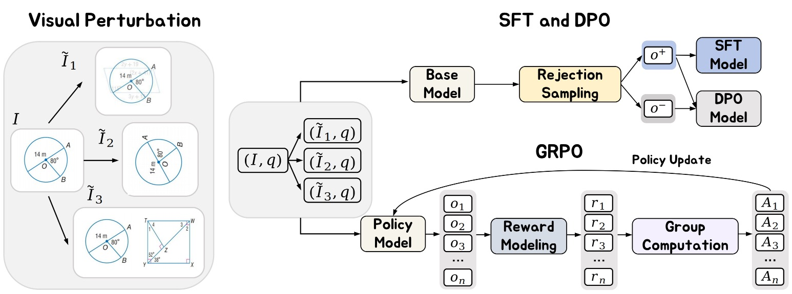

<h2 align="center">
  Vision Matters: Simple Visual Perturbations Can Boost Multimodal Math Reasoning
</h2>

<p align="center">
    <a href="https://github.com/YutingLi0606/Vision-Matters/blob/master/LICENSE">
        
    </a>
    <a href="http://arxiv.org/abs/2506.09736">
        
    </a>
   <a href="https://huggingface.co/collections/Yuting6/vision-matters-684801dd1879d3e639a930d1">
        
    </a>
    <a href="https://github.com/YutingLi0606/Vision-Matters/pulls">
        
    </a>
    <a href="https://github.com/YutingLi0606/Vision-Matters/issues">
        
    </a>
    <a href="https://github.com/YutingLi0606/Vision-Matters">
        
    </a>
    <a href="mailto:yutingli0606@gmail.com">
        
    </a>
</p>

<p align="center">
    <strong>Vision-Matters</strong> is a simple visual perturbation framework that can be easily integrated into existing post-training pipelines including SFT, DPO, and GRPO. Our findings highlight the critical role of visual perturbation: <strong>better reasoning begins with better seeing.</strong>
</p>

---

<div align="center">
  Yuting Li<sup>1</sup>,
  Lai Wei<sup>1,3</sup>,
  Kaipeng Zheng<sup>1,2</sup>,
  Jingyuan Huang<sup>1,4</sup>,
  Linghe Kong<sup>1</sup>, 
  Lichao Sun<sup>5</sup>,
  Weiran Huang<sup>1,2,4*</sup>
</div>

  
<p align="center">
<i>
1. School of Computer Science, Shanghai Jiao Tong University &nbsp;<br> 2. Shanghai Innovation Institute &nbsp; 3. Zhongguancun Academy &nbsp; <br>  4. State Key Laboratory of General Artificial Intelligence, BIGAI &nbsp; 5. Lehigh University
</i>
</p>


<p align="center">
<strong>If you like our work, please give us a ⭐!</strong>
</p>

<p align="center">
  
</p>

</details>


## 🎉 Updates
- [x] **\[2025.06.12\]** Our paper: <strong>[Vision Matters: Simple Visual Perturbations Can Boost Multimodal Math Reasoning](http://arxiv.org/abs/2506.09736)</strong> is available on arXiv.
- [x] **\[2025.06.11\]** We release our [models, datasets](https://huggingface.co/collections/Yuting6/vision-matters-684801dd1879d3e639a930d1) and [codebase](https://github.com/YutingLi0606/Vision-Matters).
## 🛠️ Installation
### SFT and DPO
For SFT and DPO training, we use [ms-swift](https://github.com/modelscope/ms-swift) framework. You can build environment refer [this](https://github.com/modelscope/ms-swift/tree/main?tab=readme-ov-file#%EF%B8%8F-installation).

To install from source:
```shell

git clone https://github.com/YutingLi0606/Vision-Matters.git
cd SFT-DPO-Training
pip install -e .
```
### GRPO
For GRPO training, we use [Easy-R1](https://github.com/hiyouga/EasyR1) framework.
- Python 3.9+
- transformers>=4.51.0
- flash-attn>=2.4.3
- vllm>=0.8.3

We provide a [Dockerfile](./Dockerfile) to easily build environments.

We recommend using the [pre-built docker image](https://hub.docker.com/r/hiyouga/verl) in EasyR1.

```bash
docker pull hiyouga/verl:ngc-th2.6.0-cu126-vllm0.8.4-flashinfer0.2.2-cxx11abi0
```
> [!NOTE]
> We recommend creating two separate environments to run SFT, DPO and GRPO independently.
## 🚀 Quick Start
### Rejection Sampling
Format your dataset in the same structure as Rejection-sampling/example.json, and then run the following command:
```bash
bash Rejection-sampling/rejection-sampling.sh
```
### Training
You can start the training with a <strong>single</strong> command:
```bash
# SFT Training
bash SFT-DPO-Training/run/sft.sh
# DPO Training
bash SFT-DPO-Training/run/dpo.sh
# GRPO Training
bash GRPO-Training/examples/example.sh
```
### Evaluation
Before running the evaluation, please download the evaluation datasets from 🤗 [Vision-Matters Evaluation](https://huggingface.co/collections/Yuting6/vision-matters-684801dd1879d3e639a930d1). 
<br>And then run: 
```bash
bash Evaluation/inf.sh
```
> [!TIP]
> How to merge model?
```shell
bash SFT-DPO-Training/run/merge.sh and bash GRPO-Training/examples/merge.sh
```
## Citation
If you use `Vision-Matters` or its methods in your work, please cite the following BibTeX entries:
<details open>
<summary> bibtex </summary>

```latex
@article{li2025vision,
  title={Vision Matters: Simple Visual Perturbations Can Boost Multimodal Math Reasoning},
  author={Li, Yuting and Wei, Lai and Zheng, Kaipeng and Huang, Jingyuan and Kong, Linghe and Sun, Lichao and Huang, Weiran},
  journal={arXiv preprint arXiv：2506.09736},
  year={2025}
}
```
</details>

## Acknowledgement
Our work is built upon [Easy-R1](https://github.com/hiyouga/EasyR1) and [ms-swift](https://github.com/modelscope/ms-swift).

✨ Feel free to contribute and reach out if you have any questions! ✨

